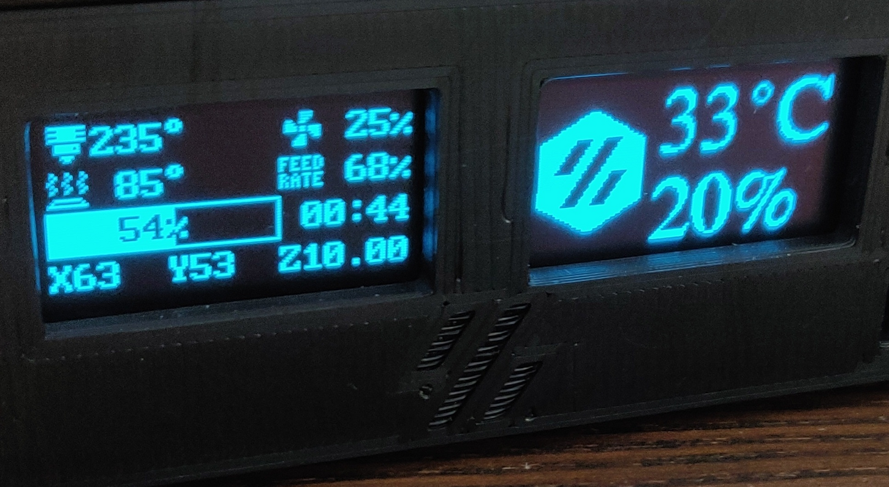
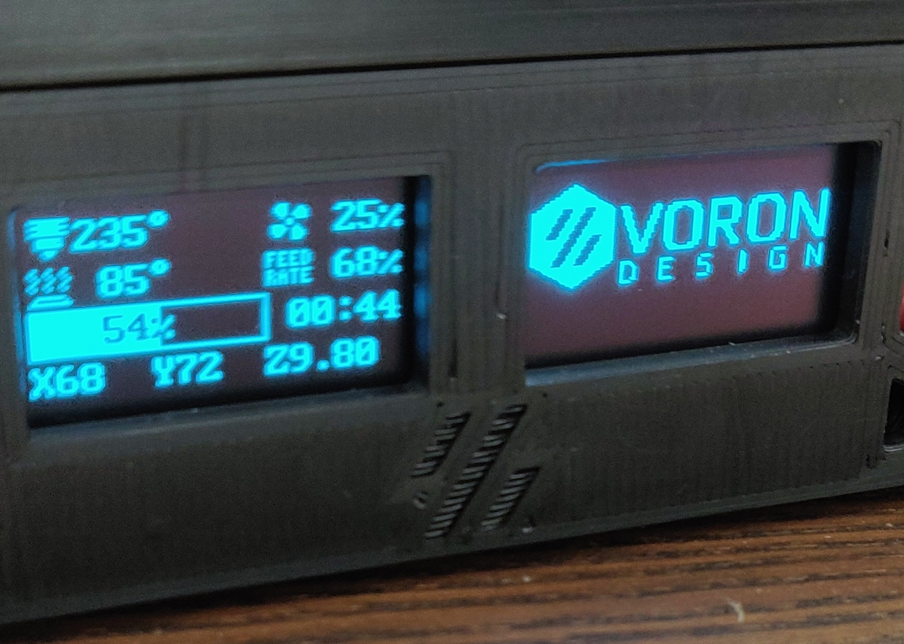
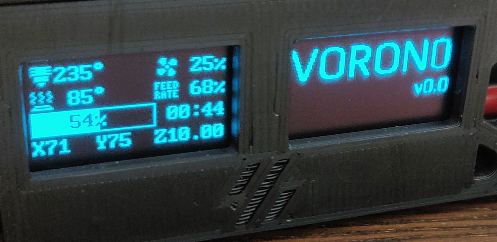
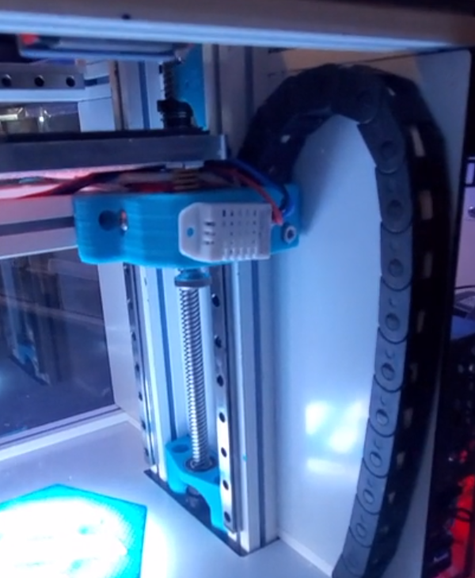

# SSD1306-Voron-0-Display-Arduino-Code
### This project was built on an Arduino Nano, using a 0.96" OLED SSD1306 screen and DHT22 temperature- and humiditysensor to monitor the enclosure. 

While I have two ssd1306 displays in my skirt, I have one connected to the skr mini e3 v1.2 and the other to the arduino nano. The original file for the OLED Skirt uses a single OLED Display, and can be found on MadrosDK's [github page](https://github.com/madrosDK/VoronUsers/tree/master/printer_mods/madros/V0_skirt_OLED) 

For reference, the display is currently set up to loop, showing the Voron Design and Voron 0 logo for 15 seconds each, followed by 25 seconds of temperature analytics. These values can easily be adjust to the desired time within the code, merely adjust the value (in seconds).  

Download the files located in the Voron Display Code folder and compile them for your arduino nano. 

This project was started by reddit user mvrckcompany who was kind enough to share [his project](https://www.reddit.com/r/arduino/comments/jq4i33/my_first_arduino_project_neopixels_oled_display/). The only modifications made were adding a second logo and a loop to the code.   

#### Temperature screen animation as created by mvrckcompany

#### Voron Design Logo 

#### Voron 0 Logo 

#### The dht22 can be attached to the Z-carriage as shown in mavericks preview

